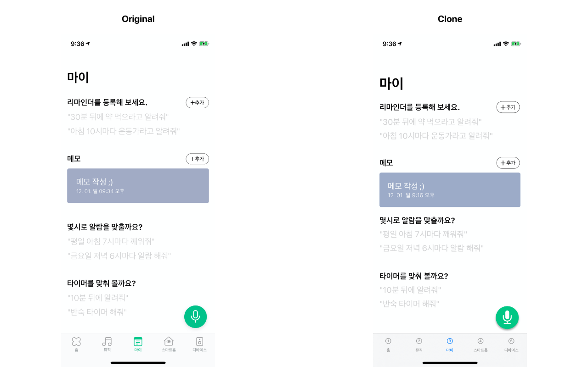
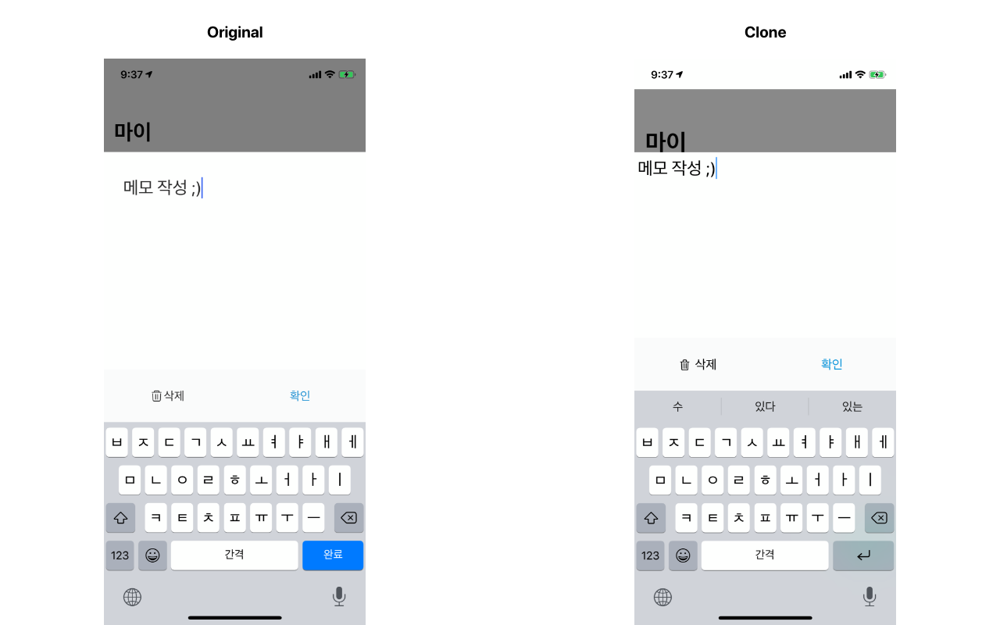
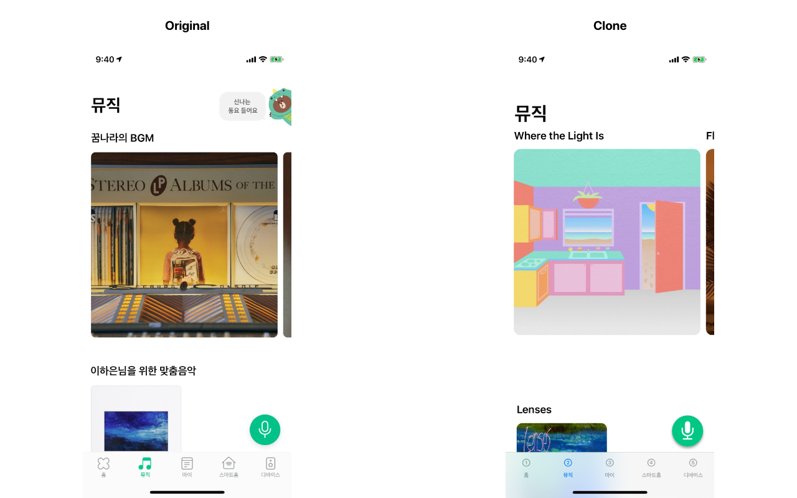
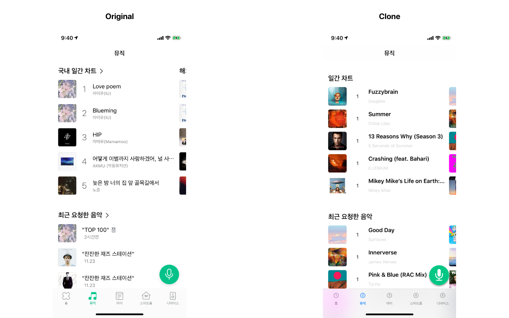
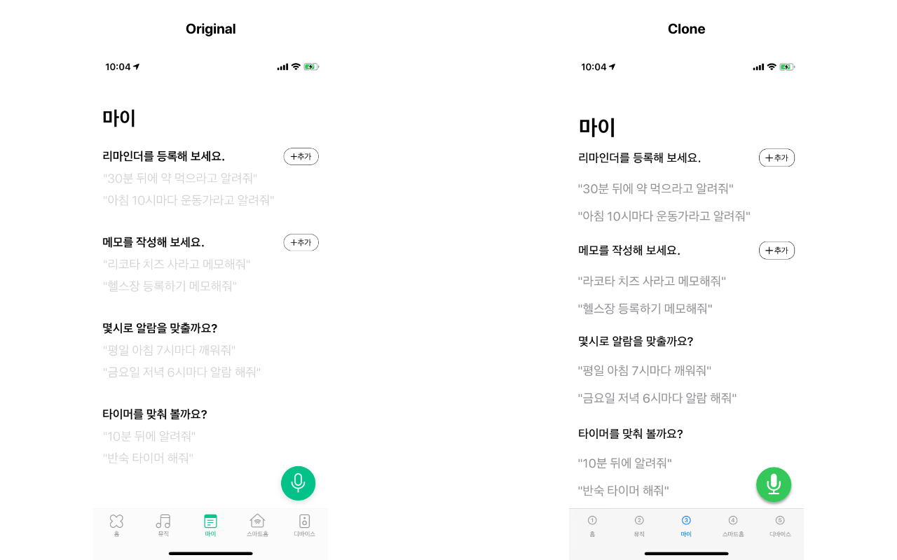

# 네이버 클로바 iOS 앱 클론 🏋️‍♀️

SwiftUI 공부를 위한 프로젝트 👩🏻‍💻

### ✔ 개발 완료

1. 뮤직 탭 완료
2. 마이 탭 메모 완료
3. 스마트홈 탭 완료
4. 디바이스 탭 완료

### 🔜 개발 예정

1. 마이탭 리마인더

## Requirement

Xcode-beta 11.3
